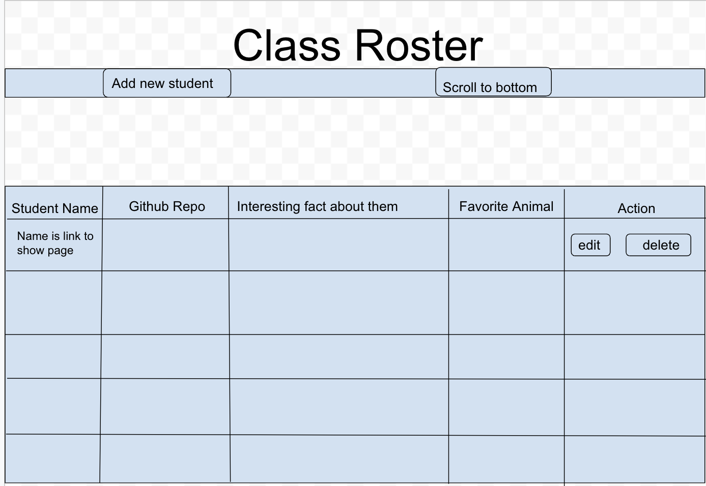
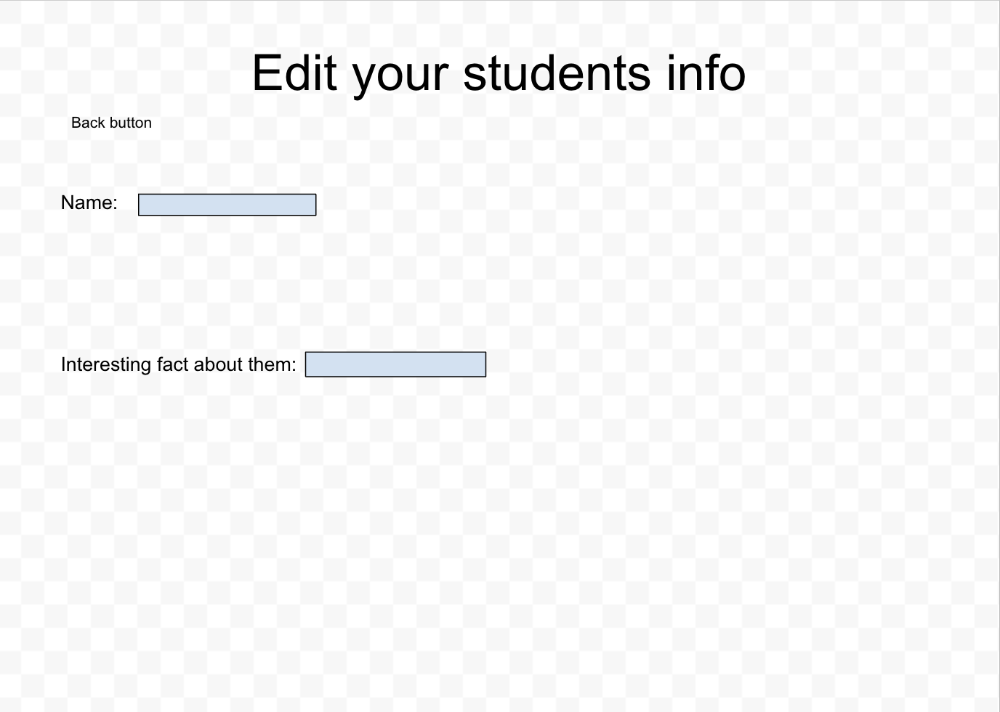
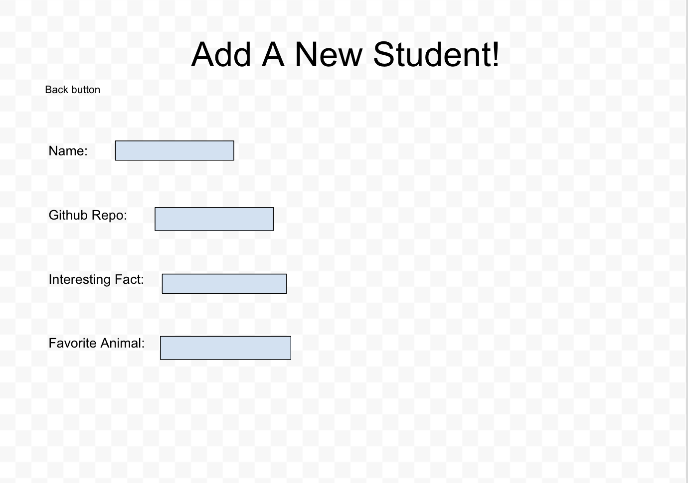
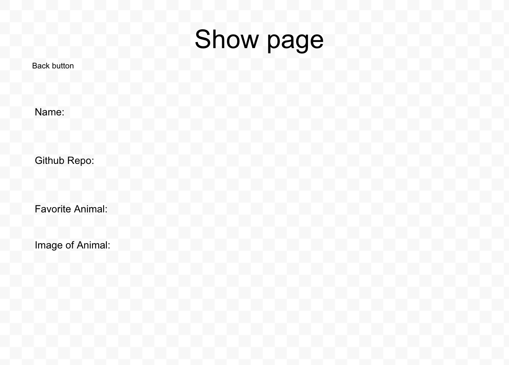

# Class_Tracker
App that allows teachers to keep track of what students they have in class

## Wireframes

 

### User Stories:
- Users (administrator, managers…) will be able to manage user profiles and account information so that they can ensure the information on the site is accurate and up-to-date.

# Live Demo
You can check a live demo [here](https://class-tracker.onrender.com).

## _Technologies used_
####  The following technologies were used to develop this app
---
- HTML
- CSS
- Node.js
- Express
- MongoDB
- ejs
---
## Challenges faced during development
Challenges like:
* Designing 
* choosing the right technologies.
* Deploying the application to render

